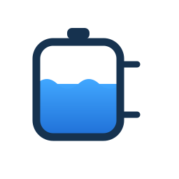
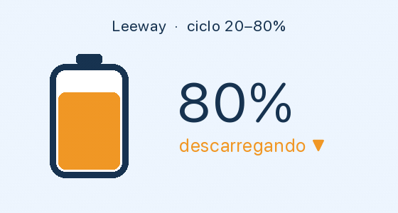
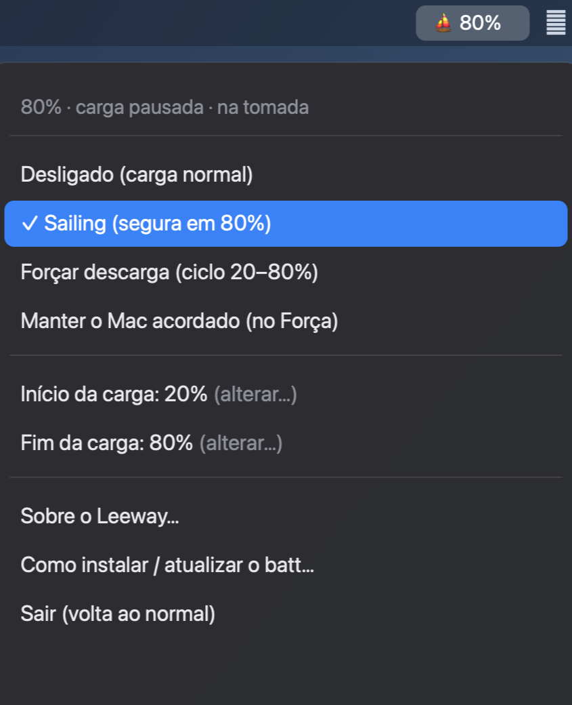

<p align="center">
  
</p>

<h1 align="center">Leeway</h1>

<p align="center">
  <a href="https://github.com/taigorene/Leeway/releases/latest"></a>
  
  
  <a href="LICENSE"></a>
</p>

<p align="center">
  
</p>

App de barra de menus para macOS (Apple Silicon) que mantém a bateria do MacBook
**entre dois limites** — início (padrão 20%) e fim (padrão 80%) — usando o `batt`
como motor. Tem dois modos de proteção:

- **Sailing** — para de carregar aos 80% e só recarrega quando a bateria cai a 20%
  pelo uso normal. Não força nada; é o mais suave.
- **Forçar descarga** — ciclo ativo: drena a bateria (mesmo na tomada) até 20% e
  recarrega até 80%, repetindo. Mais agressivo; veja os caveats abaixo.

Enquanto o app está aberto, o modo escolhido fica ativo. Ao **sair (Quit)** ou
escolher **Desligado**, a carga volta ao **comportamento normal** do notebook.

<p align="center">
  
</p>

## Como funciona

O trabalho pesado e delicado (mexer nos registradores SMC do Apple Silicon) é feito
pelo [`batt`](https://github.com/charlie0129/batt), um daemon open-source e maduro.
Este app é só uma interface fina por cima dele:

```
Leeway (barra de menus)  ──►  batt (daemon root)  ──►  hardware de carga
```

## Compatibilidade

| Item | Suporte |
|------|---------|
| Chip | ✅ **Apple Silicon** — M1, M2, M3, M4, M5 e mais novos |
| Chip | ❌ Macs **Intel** (o `batt` não suporta) |
| macOS | **13 Ventura ou mais novo** (testado no macOS 26) |
| Equipamento | **MacBook Air / MacBook Pro** (precisa ter bateria) |

Também é necessário:

- **Homebrew** — https://brew.sh
- **Python 3** — já vem no macOS

> ⚠️ Não funciona em Macs **Intel**, nem em desktops sem bateria (Mac mini / Studio /
> Pro). Para descobrir seu chip: menu  > Sobre Este Mac.

## Instalação

> **Atalho:** baixe o `Leeway.app.zip` pronto na
> [última release](https://github.com/taigorene/Leeway/releases/latest), descompacte
> e mova para `/Aplicativos`. Você ainda precisa instalar o motor `batt` e registrar
> o serviço — faça o passo 2 abaixo (ou rode só o `./install.sh`).

1. Clone o repositório e entre na pasta:

   ```bash
   git clone https://github.com/taigorene/Leeway.git
   cd Leeway
   ```

2. Rode o instalador (pede sua senha **uma vez**, para registrar o serviço de fundo):

   ```bash
   ./install.sh
   ```

   Ele instala o `batt`, prepara o ambiente Python e registra o `LaunchDaemon`.

3. Inicie o app. Duas formas:

   **App nativo (recomendado)** — gere o bundle `.app` (via `py2app`) e instale:

   ```bash
   make app
   cp -R "dist/Leeway.app" /Applications/
   ```

   Depois é só abrir o **Leeway** pelo Launchpad/Finder. É um app nativo de verdade:
   roda **só na barra de menus** (sem ícone no Dock), com ícone próprio, e abre
   apenas **uma instância**.

   **Pelo terminal (modo dev)** — sem empacotar:

   ```bash
   ./bin/leeway          # ou: make run
   ```

> **Por que não `batt install` nem `brew services`?** A versão do `batt` distribuída
> pelo Homebrew removeu o comando `batt install`, e o `brew services` do Homebrew 6.x
> não reconhece o serviço root da fórmula. Então o `install.sh` carrega o `LaunchDaemon`
> do próprio `batt` direto via `launchctl` — plist que já vem com
> `--always-allow-non-root-access`, permitindo o app ajustar os limites sem pedir senha
> toda vez. Em um laptop pessoal de usuário único isso é seguro.

## Uso

```bash
./bin/leeway        # ou: make run
```

Um indicador minimalista aparece na barra de menus — só a **carga** e um selo do
modo: `38%` (desligado), `38% ⛵` (sailing) ou `38% 🔁` (forçar descarga).

Pelo menu você escolhe um dos **modos**:

- **Desligado (carga normal)** — sem limites; carrega normalmente.
- **Sailing (segura no fim)** — para no fim e recarrega só no início, pelo uso.
- **Forçar descarga (ciclo)** — drena ativamente até o início e recarrega até o fim.

E configura:

- **Início da carga (%)** — piso do ciclo / quando voltar a carregar (padrão 20%).
- **Fim da carga (%)** — teto / quando parar de carregar (padrão 80%).
- **Manter o Mac acordado (no Força)** — opcional; impede o Mac de dormir durante o
  ciclo de força-descarga (usa `caffeinate`), pra ele não pausar quando ocioso.
- **Sobre** — versão e autor.

**Sair (volta ao normal)** fecha o app e restaura a carga normal.

## Comportamento e detalhes honestos

**Modo Sailing**

- Na tomada, com a carga limitada a 80%, a bateria **fica parada** em ~80% — ela só
  desce até o início (20%) com o **uso normal** (desconectado ou carga pesada).
  Não força descarga. É o `batt` que segura, então a proteção **persiste** mesmo se
  o app fechar.

**Modo Forçar descarga**

- O ciclo é dirigido **pelo app** (a cada 15s): para **drenar**, corta o adaptador
  (`batt adapter disable`); para **carregar**, levanta o limite (`batt disable`,
  carga livre) e religa o adaptador. O app é quem **para no fim (80%)**, virando para
  drenar. (Por que carga livre? Com um limite ativo, o `batt` segura a carga via
  maintain loop e ela **trava no piso** — foi o bug original.)
- ⚠️ **Mantenha o app aberto E o Mac acordado.** Se o Mac **dormir** durante a
  descarga (ocioso na bateria), o ciclo **pausa** — volta sozinho quando você usa o
  Mac. Para ciclar sem supervisão, mantenha-o ativo (ex.: `caffeinate -i`).
- ⚠️ Se o app fechar/crashar **durante a carga**, ele pode passar de 80% (o teto é o
  app, não o `batt`) e chegar a 100%. Se fechar **durante a descarga**, o adaptador
  fica cortado até reabrir (o macOS hiberna sozinho em bateria baixa, sem dano). Em
  saídas limpas (Quit/Desligado) e em SIGTERM/SIGINT o app **sempre religa** o
  adaptador e remove o limite; ao **abrir**, o app também religa o adaptador.
- ⚠️ **Clamshell:** com a tampa fechada + monitor externo, cortar a energia faz o Mac
  **dormir** (limitação do macOS). Force-descarga não combina com uso em clamshell.

O comportamento físico real só pode ser verificado plugando/desplugando e esperando —
a lógica e a interface são testadas, mas o ciclo depende do uso.

## Desinstalar

```bash
sudo launchctl bootout system/cc.chlc.batt          # para e remove o serviço
sudo rm /Library/LaunchDaemons/cc.chlc.batt.plist
brew uninstall batt                                 # opcional: remove o batt
```

E apague esta pasta.

## Desenvolvimento

```bash
make test        # roda os testes (lógica pura: config, engine, batt)
```

Estrutura:

- `src/leeway/config.py` — limites + preferências + persistência.
- `src/leeway/engine.py` — lógica pura (comandos `batt`, parse, ciclo).
- `src/leeway/batt.py` — wrapper fino da CLI `batt`.
- `src/leeway/keepawake.py` — `caffeinate` (manter o Mac acordado).
- `src/leeway/app.py` — app `rumps` (cola, instância única).
- `setup.py` + `app_main.py` — empacotamento do `.app` via `py2app` (`make app`).
- `assets/logo.svg` / `assets/AppIcon.icns` — logo e ícone do app.

## Licença

[MIT](LICENSE) © Taígo

O Leeway apenas **chama** o [`batt`](https://github.com/charlie0129/batt) (GPL-2.0)
como processo externo via CLI — não o redistribui nem o modifica —, então o código
deste projeto fica sob licença MIT.
